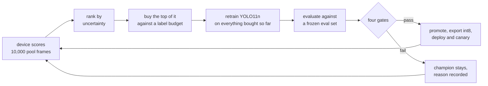

# Edge ML Flywheel

Closed-loop retraining and deployment pipeline for an edge perception model.

A model runs on a simulated edge fleet, scores unlabeled imagery, and returns the frames it is least
certain about. The cloud buys ground truth for that batch against a hard label budget, retrains, and
checks the challenger against four pass/fail gates. A passing model is promoted, converted to an edge
format, deployed to one device, watched, then rolled out or rolled back. That deployment produces new
observations, and the cycle repeats.

Every promotion decision is recorded with its supporting evidence, and each cycle's cost is
denominated in labels, so the pipeline reports accuracy gained per label spent alongside the model.

## Stack

| Layer | Technology |
|---|---|
| Data | BDD100K (Berkeley DeepDrive) — non-commercial research license |
| Cloud | AWS |
| Edge | Simulated fleet, AWS IoT Greengrass on a Graviton EC2 instance |
| Orchestration | Step Functions, single orchestrator |
| Training | SageMaker training jobs, on-demand GPU, prebuilt PyTorch container |
| Model | COCO-pretrained Ultralytics YOLO11n, frozen backbone, ONNX int8 |
| IaC | Terraform, S3 backend with native S3 locking |
| CI | GitHub Actions via OIDC, no long-lived keys |

Running cost is approximately $20/month, with the device stopped between runs.

## Repository

| Path | What is in it |
|---|---|
| [src/edge_ml_flywheel/](src/edge_ml_flywheel/) | The package — one subpackage per stage, plus `gates/`, `control/` and `reporting/` |
| [infra/](infra/) | Terraform for all of it, one file per stage |
| [container/](container/) | SageMaker entry points: train, score, evaluate |
| [buildspecs/](buildspecs/) | CodeBuild jobs: ingest, partition, register |
| [tests/](tests/) | Unit tests over the pure-logic layer |
| [verification/](verification/) | Checks that need real data or deployed infrastructure |
| [docs/](docs/) | Design documents, one per stage |

## Running it

You need an AWS account you can apply Terraform into, a SageMaker `ml.g4dn.xlarge` quota on both
training and processing jobs, Python 3.12 with `uv`, Terraform 1.10 or later, and BDD100K's
non-commercial research license accepted.

Bring-up is four steps in order: apply the Terraform, ingest the dataset, draw the partition, start a
run. [docs/running.md](docs/running.md) has the prerequisites in full, the OIDC setup and every
command.

## Scope

- **The fleet is simulated and is one device**: a Greengrass core on a Graviton instance, scoring
  pool imagery on real ARM silicon, so a cycle's ranking comes from the deployed int8 model measured
  on the hardware running it. The instance is not thermally constrained the way physical hardware
  would be.
- **No data is collected or annotated.** BDD100K ships its own ground truth, and the pipeline is
  denied read access to it, so a frame can only be labeled by buying it from the oracle against a
  metered budget.
- **One selector, no control arm.** The supported claim is a closed loop that meters label spend,
  gates against fixed thresholds, and promotes or rolls back — not that uncertainty sampling is the
  cheaper way to buy labels. The overview lists the comparison arms this leaves room for.

## Documentation

| Doc | Covers |
|---|---|
| [Architecture overview](docs/00-overview.md) | Definitions, the loop, the five stages — start here |
| [Data and labels](docs/01-data-and-labels.md) | Stage 1 |
| [Training](docs/02-training.md) | Stage 2 |
| [Evaluation](docs/03-evaluation.md) | Stage 3 |
| [Registry and promotion](docs/04-registry-and-promotion.md) | Stage 4 |
| [Fleet and deployment](docs/05-fleet-and-deployment.md) | Stage 5 |
| [Control](docs/control.md) | The state machine and the control function |
| [Gates](docs/gates.md) | The four gates and their thresholds |
| [Reporting](docs/reporting.md) | Where a finished run's summary is, and what it holds |
| [Running it](docs/running.md) | Bring-up: prerequisites, OIDC, and the commands |
