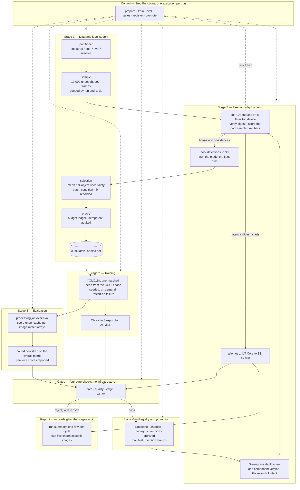

# Edge ML Flywheel — High-Level Architecture

A closed loop: an edge model ranks unlabeled frames by its own uncertainty, concentrates its label
budget on the top of that ranking, retrains, proves itself against fixed gates, and ships to the
fleet one device at a time — or rolls back. Each turn is measured in *model improvement per label
spent*.

**The ranking is produced where a fleet would produce it.** Unlabeled frames are scored on the device
by the model deployed to it, and what returns is predictions and latencies rather than footage. The
cloud trains and judges; the fleet drives and reports; labels are bought from what the fleet was
least sure about.

The system is decomposed into **five stages** a cycle passes through, and **three cross-cutting
concerns** that are not stages: control sequences the stages, gates are the contract they apply, and
reporting reads what they emit.

---

## Definitions

### Time and data

**Bootstrap** — the champion's starting training set: 8,000 images drawn at random from `train` and
labeled at partition time. The draw is random, so any gain the loop later measures is attributable
to the selector and not to the seed.

**Pool** — the 62,000 remaining `train` images, minus everything labeled so far. Image features are
available; **labels are withheld**. The pool is simultaneously the footage the simulated fleet
drives through and the catalogue selection buys from, so an image's uncertainty score and its
purchase price refer to the same frame.

**Sample** — the 10,000 pool frames one cycle puts in front of the fleet, drawn at random from what
the purchases have left and seeded by run and cycle. A cycle ranks and buys from the footage the
device actually drove, not from the whole catalogue, so the sample is what `selection_ranking_key`
covers and what a later join reads.

**Cycle** — one full turn of the loop: train, evaluate, gate, promote or reject, deploy, let the
fleet score a sample of the pool, and buy one budgeted batch of labels out of what it was least sure
about.

**Run** — a complete sequence of cycles under a single `run_id`. Starting over means starting a
new run, isolated at the storage layer so it cannot see the previous run's spent budget or
promoted models.

**Label** — one image and all of its boxes. Annotation is priced per image, so that is the unit the
budget counts.

**Label budget** — the cap on *new* labels purchasable per cycle, fixed for the whole run and
recorded in its registration. The training set is the cumulative union of everything labeled to
date, so a cycle that fails to promote still keeps its labels and the next challenger simply has
more to learn from.

**Selector** — the rule the sample is ranked by: mean per-object uncertainty from the deployed
model's pass over it. Fixed for the project rather than configured per run, so it is neither a field
on a registration nor an argument anyone passes. The model is the deployed one by construction
rather than by choice: the pass happens on the device, and the device runs the champion.

### Models

**Champion** — the model currently deployed to the fleet, and the baseline every comparison is
made against.

**Challenger** — the model newly trained in this cycle, competing to replace the champion.

**Seed** — the random seed for one training run. A cycle trains one fixed seed, compared
seed-to-seed against the champion's matching seed, so variance common to both models cancels. Seed 1
is always the artifact that ships. A run may train more seeds, and the comparison then averages over
the matching pairs.

**Promotion** — a challenger passing every gate and becoming the champion. The inverse is a
**rejection**, which is recorded with its reason rather than discarded.

### Evaluation

**Gate** — a pass/fail check with a fixed, pre-declared threshold. A hard failure stops the cycle
and leaves the champion in place.

**Slice** — a subset of the eval set defined by one factor, scored separately: all night images,
all snowy images, one object class, small objects only. Slices show what the average hides — overall
accuracy rising while one condition degrades — and they are reported and charted rather than gated.

**`eval`** — 5,000 images drawn from BDD's `val` split, labeled once at partition time and never
trained on. It is fixed for the life of a run, so cycle eight's number is comparable to cycle one's.
It is sampled in proportion to the pool, so overall accuracy is fleet-weighted, and at that size the
paired bootstrap band on the overall metric is narrow enough for a cycle's delta to clear it.

**Shadow mode** — the challenger scores the same frames as the champion at the same time, with no
effect on anything downstream, so the comparison is exact rather than statistical.

**Canary** — the challenger genuinely deployed to a device and watched there before the rollout
stands. At a fleet of one it is the whole rollout; a larger fleet makes it the first stage.

**Saturation** — the point at which another cycle stops being worth its labels, read off the label
efficiency curve flattening rather than off a detector.

---

## The loop

Solid arrows are data and artifacts. Dotted arrows are control.

---

## The stages

Listed in the order a cycle passes through them. Each owns infrastructure and compute, and each has
its own document.

| # | Stage | What it does in a cycle | Invariant it owns |
|---|---|---|---|
| 1 | **Data and label supply** | Partitions the dataset once, draws the cycle's sample out of the remaining pool, ranks what the fleet reported back by mean per-object uncertainty, buys the top of that ranking, records the ranking beside what it bought, and sells labels against a hard budget | Labels can only be obtained by paying the oracle, and `eval` is not purchasable at any price |
| 2 | **Training** | Fine-tunes YOLO11n on the cumulative labeled set at one fixed seed, from the COCO base every time, and exports an int8 ONNX artifact | Seed *k* is fixed and recorded; seed 1 is the artifact that ships, never the best-scoring seed |
| 3 | **Evaluation** | Scores each model once over `eval`, persists per-image match arrays, then answers every later question from that cache — paired deltas, confidence bands, per-slice metrics | Bootstrap the *paired* delta on a shared eval resample, never each model independently |
| 4 | **Registry and promotion** | Advances a version through an explicit state machine and records every rejection with its reason | No manifest, no promotion; every champion seed artifact is retained, not just the deployed one |
| 5 | **Fleet and deployment** | Publishes the promoted artifact as a Greengrass component and deploys it to the device, which scores the cycle's pool sample with it and sends back predictions and latencies. A failed install rolls the device back; a failed canary rolls the rollout back | Inference over unseen frames happens on the device and only predictions come home; deployment is a pointer flip, and the deployment is the only record of what a device should be running |

---

## Cross-cutting concerns

Not stages. A cycle does not pass through these; they sequence the stages, constrain them, or read
what they produce. Each is documented separately because it spans every stage rather than sitting in
one.

| Concern | What it is | Invariant it owns |
|---|---|---|
| **Control** | One Step Functions state machine and two Lambdas. Sequences the cycle, owns retries and branching, and holds a single-flight lock so two cycles cannot overlap | Control flow exists exactly once, in ASL — there is no second local orchestrator to diverge from |
| **Gates** | Four pure functions with pre-declared thresholds and no infrastructure of their own. Three are applied inside the evaluation job; the canary is applied to the device's pass, in the cycle that waited for it | Zero image-ID overlap with `eval` is a hard fail with no override, and no verdict is ever recorded without its reason |
| **Reporting** | One summary per run, written when the run ends — a row per cycle carrying the version, labels spent, the delta and its band, each gate's verdict, the deployed version and the device's p95 latency — plus queries over the telemetry and the ranking, rendered as static charts | Reporting is derived and decides nothing: every figure is read back out of the manifests, gate reports and telemetry the stages already wrote, and what a cycle decided is read off its verdicts rather than stored beside them, so a summary cannot disagree with the run it describes |

---

## Planned additions

Work the design accommodates but does not build.

**The A/A test.** A challenger trained on a bootstrap resample of the champion's own labels at the
same seed. Zero new information, so a healthy quality gate must refuse to promote, and a promotion
would mean the evaluation machinery itself has a false positive. Nothing else measures that rate,
so the supported claim is a gate that rejected honestly on live data rather than a gate whose
false-positive rate is known. It needs no second selection rule — it changes what the challenger
trains on, not how the batch was chosen — which makes it the cheapest of the three to add.

**The label-efficiency A/B.** A second run of the same length buying at random instead of by
uncertainty, orchestration and fleet stripped out, both arms paired on the same seed and the same
bootstrap. The gap between the two curves is the case for uncertainty sampling specifically.
Until it is measured, the supported claim is a closed loop that meters label spend, gates against
fixed thresholds, and promotes or rolls back — not that uncertainty selection is the cheaper way to
buy labels.

**The confidence-ordered control.** One cycle buying the images the champion is *most* certain
about. Those frames carry the least new information, so the gain should be close to nothing; a
control cycle that gains about as much as a real one indicates the uncertainty ranking is not the
source of the improvement.

Those two need a second selection rule, and there is deliberately only one: `selection.select` ranks
by uncertainty and takes no rule argument. Adding an arm therefore means adding a rule and a way to
choose between them, not changing a configuration value. That is the cost of a project with one
selector, accepted because this is a working flywheel rather than an experiment about selection.

Two properties keep the rest of the work small:

- **An arm is a run.** `run_id` already partitions every table and every purchase prefix, so two
  arms cannot read each other's ledgers without any further key design.
- **The partition and `eval` are frozen and reproducible under `partition_version`.** A later arm is
  comparable only if it trains from the same 8,000-image bootstrap and scores against the same
  5,000-image eval, which is a property of the partition rather than of when the arm is run.

Whatever chooses between two rules must stay out of the versions that force a fresh champion
baseline. A change of rule must not re-baseline, or the two arms would differ by a selector *and* a
champion.

---

## Cross-cutting invariants

Properties every stage honors, rather than components living anywhere:

- **`run_id` in the partition key of every stateful table, and in the prefix of every purchased
  batch.** A re-run must be physically unable to see the previous run's spent budget or promoted
  models, and any two comparison arms unable to read each other's purchases. DynamoDB key design
  cannot be changed after table creation, so this is decided before the first table exists.
- **Idempotency keys on anything that spends budget.** Retries and redeliveries are normal; a
  double charge against the label ledger has no undo.
- **Training is seeded and short.** Seed *k* fixes initialization and augmentation order, which is
  what the matched-seed comparison shares between champion and challenger. A failed job is discarded
  and restarted rather than resumed, which bounds model size, input resolution and dataset size.
- **`recipe_version` and `partition_version`.** A change to either means the paired comparison is no
  longer the same test on the same data universe, and forces a fresh champion baseline instead of a
  promotion decision. The class set is not among them because there is only one: it cannot differ
  between two models being compared.
- **The IAM boundary that makes the budget real.** The training role has no read access to the
  withheld labels.
- **Cost discipline.** No NAT gateway; VPC endpoints instead. A budget alarm exists before any
  other infrastructure.

---

## Companion docs

Each stage's document lands with the stage. Numbered documents are stages; unnumbered ones are
cross-cutting.

| Doc | Covers |
|---|---|
| [01-data-and-labels.md](01-data-and-labels.md) | Stage 1 |
| [02-training.md](02-training.md) | Stage 2 |
| [03-evaluation.md](03-evaluation.md) | Stage 3 |
| [04-registry-and-promotion.md](04-registry-and-promotion.md) | Stage 4 |
| [05-fleet-and-deployment.md](05-fleet-and-deployment.md) | Stage 5 |
| [control.md](control.md) | The state machine and the control function |
| [gates.md](gates.md) | The four gates and their thresholds |
| [reporting.md](reporting.md) | Where a finished run's summary is, and what it holds |

The charts are not built. They land beside [reporting.md](reporting.md) as committed static images
when they are.
