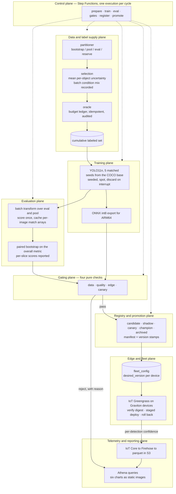

# Edge ML Flywheel — High-Level Architecture

A closed loop: an edge model ranks unlabeled frames by its own uncertainty, concentrates its label
budget on the top of that ranking, retrains, proves itself against fixed gates, and ships to the
fleet one device at a time — or rolls back. Each turn is measured in *model improvement per label
spent*.

The system is decomposed into **nine planes**. Seven sit inside the loop; two wrap it.

---

## Definitions

### Time and data

**Bootstrap** — the champion's starting training set: 8,000 images drawn at random from `train` and
labeled at partition time. The draw is random, so any gain the loop later measures is attributable
to the selector and not to the seed.

**Pool** — the 62,000 remaining `train` images, minus everything labeled so far. Image features are
available; **labels are withheld**. The pool is simultaneously the footage the simulated fleet
drives through and the catalogue selection buys from, so an image's uncertainty score and its
purchase price refer to the same frame.

**Cycle** — one full turn of the loop: score the pool, buy one budgeted batch of labels, train,
evaluate, gate, promote or reject, deploy.

**Run** — a complete sequence of cycles under a single `run_id`. Starting over means starting a
new run, isolated at the storage layer so it cannot see the previous run's spent budget or
promoted models.

**Label** — one image and all of its boxes. Annotation is priced per image, so that is the unit the
budget counts.

**Label budget** — the cap on *new* labels purchasable per cycle, fixed for the whole run and
recorded in its registration. The training set is the cumulative union of everything labeled to
date, so a cycle that fails to promote still keeps its labels and the next challenger simply has
more to learn from.

**Selector** — the rule the pool is ranked by: mean per-object uncertainty from the champion's
scoring pass. Fixed for the project rather than configured per run, so it is neither a field on a
registration nor an argument anyone passes.

### Models

**Champion** — the model currently deployed to the fleet, and the baseline every comparison is
made against.

**Challenger** — the model newly trained in this cycle, competing to replace the champion.

**Seed** — the random seed for one training run. Each model is trained at five fixed seeds and
compared seed-to-seed against the champion's matching seed, so variance common to both models
cancels. Seed 1 is always the artifact that ships.

**Promotion** — a challenger passing every gate and becoming the champion. The inverse is a
**rejection**, which is recorded with its reason rather than discarded.

### Evaluation

**Gate** — a pass/fail check with a fixed, pre-declared threshold. A hard failure stops the cycle
and leaves the champion in place.

**Slice** — a subset of the eval set defined by one factor, scored separately: all night images,
all snowy images, one object class, small objects only. Slices show what the average hides — overall
accuracy rising while one condition degrades — and they are reported and charted rather than gated.

**`eval`** — 5,000 images drawn from BDD's `val` split, labeled once at partition time and never
trained on. It is fixed for the life of a run, so cycle eight's number is comparable to cycle one's.
It is sampled in proportion to the pool, so overall accuracy is fleet-weighted, and at that size the
paired bootstrap band on the overall metric is narrow enough for a cycle's delta to clear it.

**Shadow mode** — the challenger scores the same frames as the champion at the same time, with no
effect on anything downstream, so the comparison is exact rather than statistical.

**Canary** — the challenger genuinely deployed to one device out of five, watched before the
rollout continues.

**Saturation** — the point at which another cycle stops being worth its labels, read off the label
efficiency curve flattening rather than off a detector.

---

## The loop

Solid arrows are data and artifacts. Dotted arrows are control.

---

## The planes

Listed in the order a cycle passes through them.

| # | Plane | What it does in a cycle | Invariant it owns |
|---|---|---|---|
| 1 | **Data and label supply** | Partitions the dataset once, ranks the remaining pool by mean per-object uncertainty from the champion's offline scoring pass, buys the top of that ranking, records the batch's condition mix beside the pool's, and sells labels against a hard budget | Labels can only be obtained by paying the oracle, and `eval` is not purchasable at any price |
| 2 | **Training** | Fine-tunes YOLO11n on the cumulative labeled set with five fixed seeds, from the COCO base every time, and exports an int8 ONNX artifact | Seed *k* is fixed and recorded; seed 1 is the artifact that ships, never the best-scoring seed |
| 3 | **Evaluation** | Scores each model once over `eval` and the pool, persists per-image match arrays, then answers every later question from that cache — paired deltas, confidence bands, per-slice metrics | Bootstrap the *paired* delta on a shared eval resample, never each model independently |
| 4 | **Gating** | Runs four pass/fail checks in order — data, quality, edge, canary — and emits the per-slice regression report. Any hard failure stops the cycle and the champion stays put; the labels stay bought | Zero image-ID overlap with either eval set is a hard fail with no override |
| 5 | **Control** | Sequences the cycle, owns retries, branching and short-circuit on gate failure, and holds a single-flight lock so two cycles cannot overlap | Control flow exists exactly once, in ASL — there is no second local orchestrator to diverge from |
| 6 | **Registry and promotion** | Advances a version through an explicit state machine and records every rejection with its reason | No manifest, no promotion; all five champion seed artifacts are retained, not just the deployed one |
| 7 | **Edge and fleet** | Publishes the promoted artifact as a Greengrass component, and the service deploys it: verify digest, one device, then two, then the fleet, rolling back on a failed health check | Deployment is a pointer flip, never a container rebuild; rollback is a single command |
| 8 | **Telemetry and reporting** | Captures what the fleet saw and feeds the charts. The fleet's own ranking is a realism check, not a selector | Every promotion and rejection is charted with its evidence, so the loop's behaviour is read off the record rather than described |
| 9 | **Experiment and validation** | Runs cycles *as experiments* rather than running inside one: the A/A control | The gate's false-positive rate is measured, not assumed |

---

## Plane 9 in more detail

Planes 1-8 turn the loop. Plane 9 establishes that the loop's measurements can be trusted.

- **The A/A test** trains a challenger on a bootstrap resample of the champion's own labels, same
  five seeds. Zero new information, so a healthy quality gate must refuse to promote. If it ever
  promotes, the evaluation machinery itself has a false positive.

The A/A test needs no second selection rule — it changes what the challenger trains on, not how the
batch was chosen — which is why it is the control this project runs. The two controls that *would*
need a second rule are deferred. See [planned additions](#planned-additions).

---

## Planned additions

Work the design accommodates but does not build.

**The label-efficiency A/B.** A second run of the same length buying at random instead of by
uncertainty, orchestration and fleet stripped out, both arms paired on the same five seeds and the
same bootstrap. The gap between the two curves is the case for uncertainty sampling specifically.
Until it is measured, the supported claim is a closed loop that meters label spend, gates against
fixed thresholds, and promotes or rolls back — not that uncertainty selection is the cheaper way to
buy labels.

**The confidence-ordered control.** One cycle buying the images the champion is *most* certain
about. Those frames carry the least new information, so the gain should be close to nothing; a
control cycle that gains about as much as a real one indicates the uncertainty ranking is not the
source of the improvement.

Both need a second selection rule, and there is deliberately only one: `selection.select` ranks by
uncertainty and takes no rule argument. Adding an arm therefore means adding a rule and a way to
choose between them, not changing a configuration value. That is the cost of a project with one
selector, accepted because this is a working flywheel rather than an experiment about selection.

Two properties keep the rest of the work small:

- **An arm is a run.** `run_id` already partitions every table and every purchase prefix, so two
  arms cannot read each other's ledgers without any further key design.
- **The partition and `eval` are frozen and reproducible under `partition_version`.** A later arm is
  comparable only if it trains from the same 8,000-image bootstrap and scores against the same
  5,000-image eval, which is a property of the partition rather than of when the arm is run.

Whatever chooses between two rules must stay out of the versions that force a fresh champion
baseline. A change of rule must not re-baseline, or the two arms would differ by a selector *and* a
champion.

---

## Cross-cutting invariants

Properties every plane honors, rather than components living anywhere:

- **`run_id` in the partition key of every stateful table, and in the prefix of every purchased
  batch.** A re-run must be physically unable to see the previous run's spent budget or promoted
  models, and any two comparison arms unable to read each other's purchases. DynamoDB key design
  cannot be changed after table creation, so this is decided before the first table exists.
- **Idempotency keys on anything that spends budget.** Retries and redeliveries are normal; a
  double charge against the label ledger has no undo.
- **Training is seeded and short.** Seed *k* fixes initialization and augmentation order, which is
  what the matched-seed comparison shares between champion and challenger. An interrupted job is
  discarded and restarted rather than resumed, which bounds model size, input resolution and
  dataset size.
- **`recipe_version` and `partition_version`.** A change to either means the paired comparison is no
  longer the same test on the same data universe, and forces a fresh champion baseline instead of a
  promotion decision. The class set is not among them because there is only one: it cannot differ
  between two models being compared.
- **The IAM boundary that makes the budget real.** The training role has no read access to the
  withheld labels.
- **Cost discipline.** No NAT gateway; VPC endpoints instead. A budget alarm exists before any
  other infrastructure.

---

## Companion docs

Each plane's document lands with the plane.

| Doc | Plane |
|---|---|
| `01-data-and-labels.md` | 1 |
| `02-training.md` | 2 |
